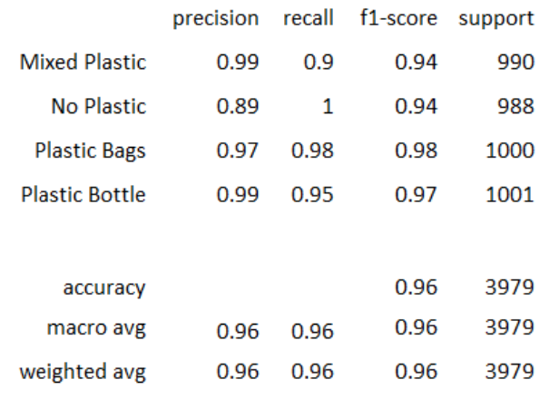

# Rubbish-Classification
A PyTorch model for the detection and classification of rubbish in the environment from images.

Example observations/images:

Data augmentation was applied to an extremely small dataset (~88 images) to train a transfer learing model on this task.

The ResNet50 model was trained for 10 epochs.

Learning rate = 0.001, Batch size = 8

The resulting classification report is as follows:

---

# Model Documentation
## 1 - Dataset Labels
Images within the dataset were labelled using the following classifications:

0. Mixed Plastic
1. No Plastic
2. Plastic Bags
3. Plastic Bottles

Image names and their classification labels were stored within a .csv file named ‘Images_metatdata.csv’ which uses the following structure:

| image_id | image_id_root | label |
| -------- | ------------- | ----- |
IMG_0409.JPG | IMG_0409 | No Plastic
IMG_6949.JPG | IMG_6949 | Plastic Bottle
IMG_6950.JPG | IMG_6950 | No Plastic
IMG_6951.JPG | IMG_6951 | Plastic Bags
IMG_6952.JPG | IMG_6952 | Mixed Plastic

---

## 2 - Folder structure for dataset

The folder structure used for loading this dataset is as follows:

    dataset_root/
        -- Images/
            -- image001.JPG 
            -- image002.JPG 
            -- image003.JPG
        -- Images_metadata.csv

The following sections document the process for loading the data.

---

## 3 - Loading the model
The inference script (Jupyter notebook) that is used to load the data and load the model is provided and is titled:

`Model_Data_Loader.ipynb`

This notebook can be used to load the trained model which is titled:

`Model_Trained.pt`

---

## 4 - Reporting predictions on test dataset
Once the dataset and model have been loaded (*using* `Model_Data_Loader.ipynb`) and the trained model
is loaded (*using* `Model_Trained.pt`) the predictions may be reported using the following methods:

1. Confusion matrix
2. Classification report
3. Classification label error plot
---
